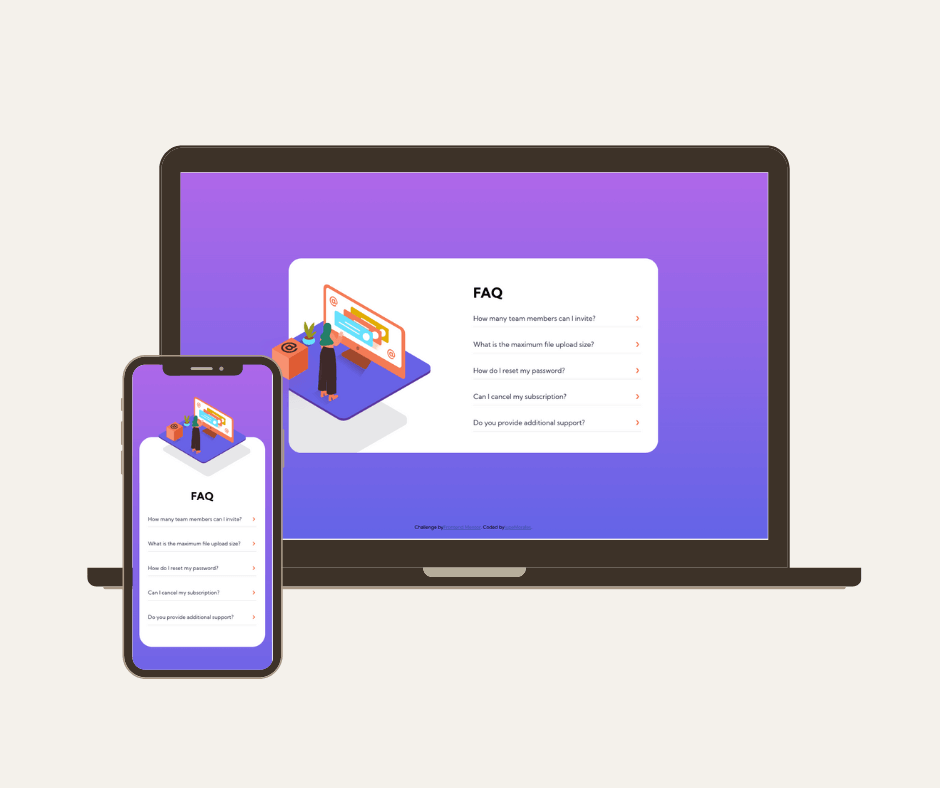

# FAQ accordion card

## Welcome! 👋

This is my solution to the [FAQ Accordion card challenge on Frontend Mentor](https://www.frontendmentor.io/challenges/faq-accordion-card-XlyjD0Oam).
I would like to say that I enjoyed it very much.

## The challenge

The challenge is to build out this FAQ accordion card and get it looking as close to the design as possible.

Your users should be able to:

- View the optimal layout for the component depending on their device's screen size
- See hover states for all interactive elements on the page
- Hide/Show the answer to a question when the question is clicked
- **Bonus**: Complete the challenge without using JavaScript

### Screenshot

### Links

- Solution URL: [Code](https://github.com/lupeMorales/faq-accordion)
- Live Site URL: [Demo](https://lupemorales.github.io/faq-accordion/)
 
## Built with

- Semantic HTML5 markup
- CSS custom properties
- Flexbox
- CSS Grid
- Mobile-first workflow

## Author

- Website - [My portfolio web](https://lupemorales.github.io/portfolio/)
- Linkedin - [@LupeMorales](https://www.linkedin.com/in/lupe-morales/)

**Have fun coding!** 🚀
